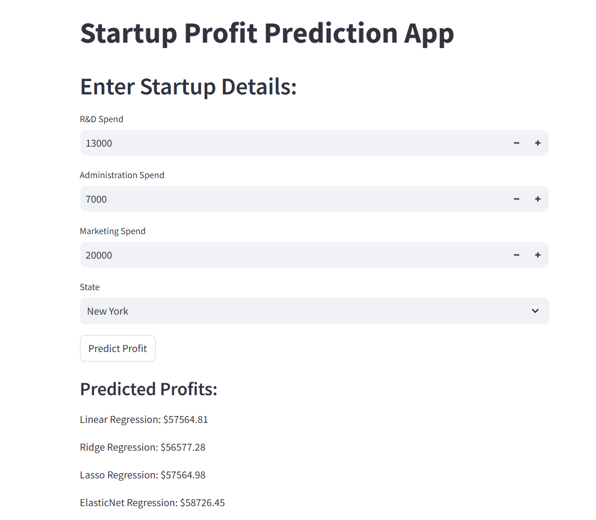

# Startup Profit Prediction App

This is a Streamlit app for predicting startup profits based on R&D Spend, Administration Spend, Marketing Spend, and State. The app uses four regression models (Linear, Ridge, Lasso, ElasticNet).

The dateset was taken from Kaggle "50 Startups Dataset"

## Features
- Input fields for R&D Spend, Administration Spend, Marketing Spend, and State.
- Predictions from four regression models.

## How to run the app
- Navigate through the directory where you have all files required to run the app (app.py, elastic.pkl, lasso.pkl, linear_regression.pkl, ridge.pkl, scaler.pkl)
- Run the following command: streamlit run app.py

## Screenshot of UI
